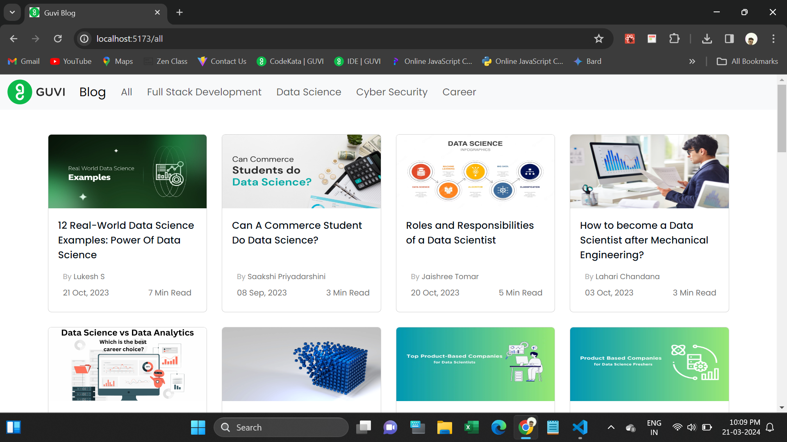

# React Router Task

This webpage is used to read blog.

Here is various blog in Full Stack Development, Cyber Security, Data Science, Career.

Its fully Responsive.

  <h4>Used Tools</h4>
<ul>
  <li>Html</li>
  <li>CSS</li>
  <li>Bootstrap</li>
  <li>Javascript</li>
  <li>React JS</li>
</ul>
<h4>Npm Packages are used:</h4>
<ul>
  <li>https://www.npmjs.com/package/bootstrap</li>
  <li>https://www.npmjs.com/package/@fontsource/poppins</li>
  <li>https://www.npmjs.com/package/react-router-dom</li>
</ul>
<h3>Deployed URL</h3>
https://guvi-blogs.netlify.app/

<h5>Screenshots</h5>
1.Home Page

